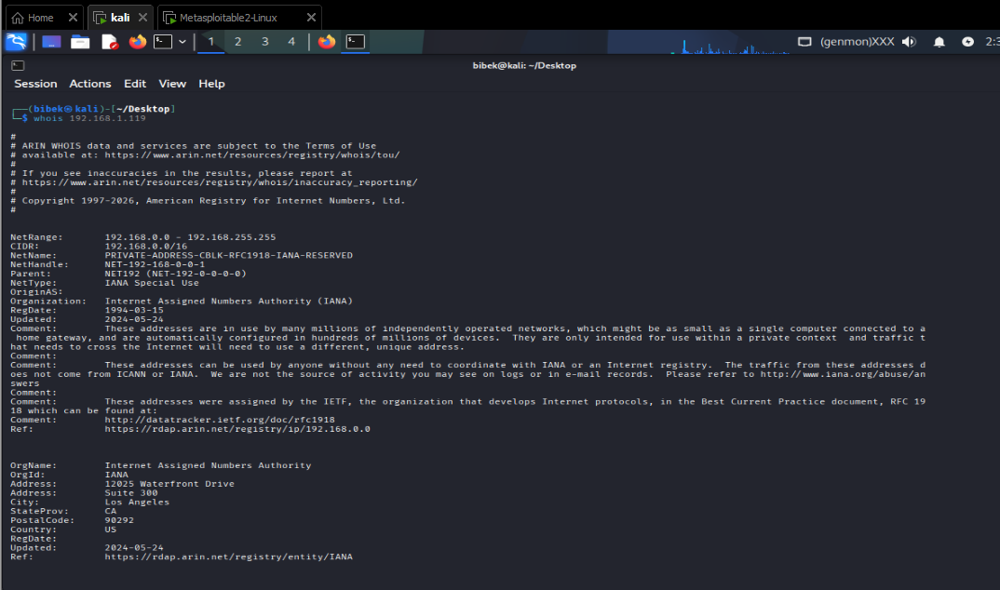
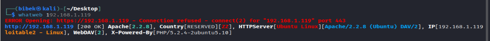
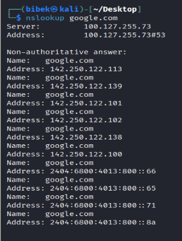
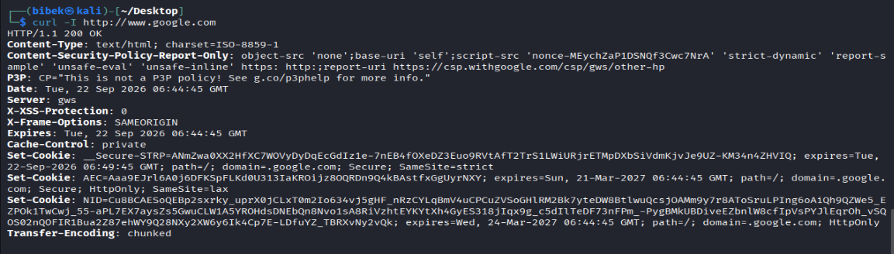
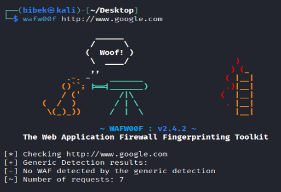
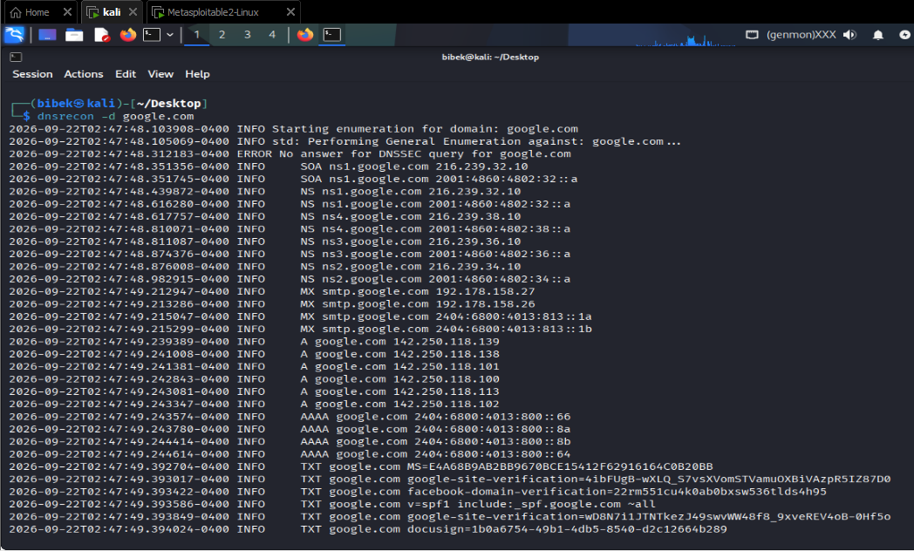

# Basic Web Reconnaissance Toolkit

A beginner-friendly walkthrough of six passive/basic reconnaissance tools commonly used during the early information-gathering phase of an authorized security assessment. Each section explains the tool, the underlying concept, the exact command to run, and how to interpret the output.

> ⚠️ **Authorization Notice**
> All techniques in this document must **only** be performed against domains, hosts, or systems that you own, or for which you have explicit, documented permission to test. Running reconnaissance or scanning tools against systems without authorization may violate computer misuse laws in your jurisdiction. Throughout this document, `example.com` is used strictly as a placeholder target.

---

## Table of Contents

1. [WHOIS](#task-1--whois)
2. [WhatWeb](#task-2--whatweb)
3. [nslookup](#task-3--nslookup)
4. [curl -I](#task-4--curl--i)
5. [WAFW00F](#task-5--wafw00f)
6. [DNSRecon](#task-6--dnsrecon)
7. [Reconnaissance Workflow](#reconnaissance-workflow)
8. [Comparison Table](#comparison-table)
9. [Screenshot Organization](#screenshot-organization)

---

##  1 — WHOIS

### Objective
Discover the registration details behind a domain name — who registered it, when, through which registrar, and how it is currently managed — to build a basic picture of the target's ownership and administrative footprint.

### Tool
`whois` is a query protocol/client used to look up records from domain registries and registrars. It's one of the oldest and most widely used reconnaissance utilities, standard on almost every Linux distribution.

### How It Works
Every registered domain has a record stored with its registry and registrar. When you query WHOIS, your request is routed to the appropriate registry (and often referred to the registrar) which returns the publicly available registration data for that domain. In recent years, some of this has migrated to the newer **RDAP** (Registration Data Access Protocol), which returns structured JSON instead of plain text, but the underlying purpose is the same.

### Command
```bash
whois example.com
```

### What the Output Means
| Field | What It Tells You |
|---|---|
| **Registrar** | The company through which the domain was registered (e.g., GoDaddy, Namecheap) |
| **Creation Date** | When the domain was first registered |
| **Expiration Date** | When the current registration period ends |
| **Domain Status** | EPP status codes (e.g., `clientTransferProhibited`) indicating locks or restrictions on the domain |
| **Name Servers** | The authoritative DNS servers for the domain — often reveals hosting/DNS provider |
| **Registrant Information** | Owner/contact details, if not hidden behind privacy protection |
| **Privacy/Proxy Protection** | Indicates whether a privacy service is masking the real registrant's contact details |

**Note:** WHOIS output varies significantly depending on the registrar, the registry (TLD operator), applicable privacy regulations (e.g., GDPR), and whether the domain has moved to RDAP-only responses. Don't assume the absence of a field means the data doesn't exist — it may simply be redacted.

### Screenshot




### Example Observations
Without inventing real data, a beginner running this command might typically notice things like: a named registrar, a set of nameservers pointing to a specific DNS/hosting provider, and registrant fields that are partially or fully redacted due to privacy protection.

### Security/Recon Relevance
Registrar and nameserver information can hint at the hosting provider or infrastructure stack in use. Creation/expiration dates help build a timeline of the domain's history. Domain status codes can reveal whether a domain is locked against transfer, which is sometimes relevant in social-engineering or domain-hijacking risk assessments.

### Notes
- WHOIS data is increasingly restricted by privacy laws (GDPR, CCPA) — expect many fields to be redacted for domains registered by individuals.
- Some registries have deprecated plain-text WHOIS in favor of RDAP; results may differ depending on the tool/client version.

---

##  2 — WhatWeb

### Objective
Identify the technologies powering a website — its web server, content management system (CMS), frameworks, and other software components.

### Tool
`WhatWeb` is a website fingerprinting tool that inspects HTTP responses, HTML source, headers, and cookies to identify signatures matching known software and services. It's commonly used in the early stages of a web application assessment to understand the target's technology stack.

### How It Works
WhatWeb sends requests to the target and compares the response (headers, meta tags, JavaScript file names, cookie names, error pages, etc.) against a large database of known fingerprints. Each match increases confidence that a particular technology is in use.

### Command
```bash
whatweb https://example.com
```

### What the Output Means
| Result Type | What It Tells You |
|---|---|
| **Web Server** | e.g., Apache, Nginx, IIS — from the `Server` header or behavior fingerprints |
| **CMS** | e.g., WordPress, Joomla, Drupal — detected via known paths, meta generator tags |
| **JS Frameworks/Libraries** | e.g., React, jQuery — detected via script references |
| **Programming Language Indicators** | e.g., PHP, ASP.NET — from headers, cookies, or file extensions |
| **Analytics** | e.g., Google Analytics — detected via embedded tracking scripts |
| **HTTP Headers/Cookies** | Session cookie names, security headers, and other server-set values |

### Screenshot
```

```

### Example Observations
A beginner might typically observe a detected web server type, possibly a CMS if one is in use, and a handful of supporting technology tags — without knowing in advance which will appear, since this depends entirely on the target.

### Security/Recon Relevance
Knowing the exact software stack narrows down which vulnerabilities, default configurations, or known CVEs might apply. It also helps prioritize which further tools or techniques are worth using later in an assessment.

### Notes
- Fingerprinting is signature-based and can produce false positives/negatives, especially on hardened or heavily customized sites.
- Aggressive scan modes exist but are more intrusive — stick to passive/default settings for basic recon.

---

##  3 — nslookup

### Objective
Resolve the domain name to its underlying IP address(es) as a first step toward understanding where the site is hosted.

### Tool
`nslookup` is a built-in command-line utility for querying the Domain Name System (DNS) to resolve hostnames to IP addresses (and vice versa).

### How It Works
When you query a domain, `nslookup` sends a request to a DNS resolver (either your system's configured resolver or a specified one), which returns the DNS records associated with that name — most commonly the A (IPv4) or AAAA (IPv6) record.

### Command
```bash
nslookup example.com
```

### What the Output Means
| Field | What It Tells You |
|---|---|
| **DNS Resolver Used** | The server that answered the query (shown at the top of the output) |
| **A Record** | The IPv4 address the domain resolves to |
| **AAAA Record** | The IPv6 address, if one exists |

**Important:** The resolved IP address does not necessarily represent the "real" origin server. Many sites sit behind a CDN, reverse proxy, or load balancer (e.g., Cloudflare), meaning the IP you see belongs to the CDN edge node — not the actual backend infrastructure.

### Screenshot
```

```

### Example Observations
A beginner would typically see one or more resolved IPv4 addresses, and possibly an IPv6 address, associated with the domain.

### Security/Recon Relevance
The resolved IP is a starting point for further passive lookups (e.g., identifying the hosting provider, ASN, or geographic region). It also helps determine whether a CDN or WAF-fronted service may be shielding the true origin server, which is useful context before deeper testing.

### Notes
- DNS results can be cached and may not always reflect the very latest record changes.
- Different DNS resolvers can sometimes return different results due to propagation delays or geo-based DNS responses.

---

##  4 — curl -I

### Objective
Retrieve the raw HTTP response headers returned by a web server to understand how it responds, what technologies it exposes, and what security controls are configured.

### Tool
`curl` is a command-line tool for transferring data with URLs. The `-I` flag tells it to fetch only the HTTP headers (via a HEAD request) rather than the full page body.

### How It Works
`curl -I` sends a HEAD request to the target server. The server responds with a status line and a set of HTTP headers describing the response — without sending the actual page content — making it a lightweight way to inspect server behavior and configuration.

### Command
```bash
curl -I https://example.com
```

### What the Output Means
| Header | What It Tells You |
|---|---|
| **HTTP Status Code** | e.g., `200 OK`, `301 Moved Permanently` — the outcome of the request |
| **Server** | The web server software/version, if disclosed |
| **Content-Type** | The MIME type of the response |
| **Location** | Present on redirects; shows the destination URL |
| **Set-Cookie** | Cookies the server is setting, which can hint at session frameworks |
| **Cache-Control** | Caching directives for the response |
| **Content-Security-Policy** | Defines allowed sources for scripts, styles, etc. — a security-hardening header |
| **Strict-Transport-Security** | Indicates HSTS is enforced, requiring HTTPS |
| **X-Frame-Options** | Controls whether the page can be embedded in a frame (clickjacking protection) |
| **Other Security Headers** | e.g., `X-Content-Type-Options`, `Referrer-Policy` when present |

### Screenshot
```

```

### Example Observations
A beginner would typically see a status code, some server-identifying header (or its deliberate absence), and a mix of caching/security headers — the exact combination depends entirely on how the target is configured.

### Security/Recon Relevance
Response headers reveal server software versions (useful for identifying known vulnerabilities), the presence or absence of security headers (indicating the site's overall security posture), and redirect behavior (useful for mapping site structure).

### Notes
- Many production servers deliberately suppress or obscure the `Server` header to reduce information disclosure.
- Header presence alone doesn't confirm a control is effective — it only indicates configuration intent.

---

##  5 — WAFW00F

### Objective
Determine whether the target website is protected by a Web Application Firewall (WAF), and if possible, identify which vendor's WAF is in use.

### Tool
`wafw00f` is a tool specifically designed to detect and fingerprint WAFs by analyzing how a target responds to both normal and specially-crafted requests.

### How It Works
- **What a WAF is:** A Web Application Firewall sits in front of a web application and filters, monitors, or blocks malicious HTTP traffic (e.g., SQL injection or XSS attempts) before it reaches the application.
- **How wafw00f identifies it:** The tool sends a series of requests — including some that mimic suspicious patterns — and compares the responses (status codes, headers, cookies, block pages) against a database of known WAF signatures.
- **A positive detection** means the response pattern matched a known WAF's signature with reasonable confidence.
- **A negative/unknown result** means no known signature matched — this could mean there truly is no WAF, or it could mean an unrecognized/custom WAF is in use that evaded detection.
- **Accuracy caveat:** WAF vendors regularly change behavior, and some WAFs are configured to blend in with normal traffic specifically to resist fingerprinting — so results should be treated as an indicator, not a certainty.

### Command
```bash
wafw00f https://example.com
```

### Screenshot
```

```

### Example Observations
A beginner might see a message indicating a WAF was detected (naming a possible vendor) or a message indicating no WAF could be identified — the actual result depends on the target's real configuration.

### Security/Recon Relevance
Knowing whether a WAF is present shapes how further testing should be approached — some tests may be blocked, rate-limited, or trigger alerts. It also helps set realistic expectations about how much traffic an assessment might generate before being filtered.

### Notes
- Detection is signature-based and can produce false negatives against well-hardened or custom WAF deployments.
- Running this tool generates additional traffic to the target — even in passive assessments, be mindful of request volume and scope.

---

##  6 — DNSRecon

### Objective
Enumerate the broader set of DNS records associated with a domain to build a more complete picture of its infrastructure beyond a single A record lookup.

### Tool
`DNSRecon` is a Python-based DNS enumeration tool that automates a wide range of DNS-related checks, including standard record lookups, zone transfer attempts, and (in more active modes) subdomain brute-forcing.

### How It Works
DNSRecon queries the domain's authoritative name servers for a variety of DNS record types in sequence, compiling the results into a single report. In its basic/standard mode, this is a passive-style enumeration of the records that are already publicly published for the domain.

### Command
```bash
dnsrecon -d example.com
```

### What the Output Means
| Record Type | What It Tells You |
|---|---|
| **A** | IPv4 address(es) the domain resolves to |
| **AAAA** | IPv6 address(es), if configured |
| **MX** | Mail servers responsible for handling email for the domain |
| **NS** | Authoritative name servers for the domain |
| **CNAME** | Aliases pointing one hostname to another |
| **TXT** | Free-text records often used for SPF/DKIM/domain verification |
| **SOA** | Start of Authority — administrative details about the DNS zone |
| **PTR** | Reverse DNS mapping (IP → hostname), where applicable |

### Screenshot
```

```

### Example Observations
A beginner would typically see a structured list of the record types above, populated only where the domain actually has them configured — for example, MX records only appear if the domain handles email.

### Security/Recon Relevance
A fuller DNS record set helps map out related infrastructure — mail servers, verification/TXT records revealing third-party service usage (e.g., SPF entries naming email providers), and CNAME chains that may point to additional subdomains or third-party services worth investigating.

### Notes
- Some DNSRecon modes (e.g., zone transfer attempts, brute-force enumeration) are more active and intrusive than a basic record lookup — stick to standard enumeration for passive recon, and only use active modes within your authorized scope.
- Not every domain will have every record type; absence of a record type is normal and not itself a finding.

---

## Reconnaissance Workflow

A simple, beginner-friendly way to chain these six tools into a basic reconnaissance pass:


1. **WHOIS** — Start with ownership and registration context.
2. **WhatWeb** — Identify the technology stack running on the site.
3. **nslookup** — Resolve the domain to its IP address(es).
4. **curl -I** — Inspect HTTP headers for server details and security posture.
5. **wafw00f** — Check for a WAF before considering any further, more active testing.
6. **DNSRecon** — Round out the picture with the domain's full DNS record set.

Each step builds on the last: registration and hosting context → software stack → network location → HTTP-level behavior → defensive controls → infrastructure map.

---

## Comparison Table

| Tool | Purpose | Main Information Obtained | Example Command |
|---|---|---|---|
| **WHOIS** | Domain registration lookup | Registrar, dates, nameservers, registrant | `whois example.com` |
| **WhatWeb** | Web technology fingerprinting | Server, CMS, frameworks, analytics | `whatweb https://example.com` |
| **nslookup** | DNS resolution | IPv4/IPv6 address(es) | `nslookup example.com` |
| **curl -I** | HTTP header inspection | Status code, server, security headers | `curl -I https://example.com` |
| **WAFW00F** | WAF detection | Presence/vendor of a Web Application Firewall | `wafw00f https://example.com` |
| **DNSRecon** | DNS record enumeration | A, AAAA, MX, NS, CNAME, TXT, SOA, PTR records | `dnsrecon -d example.com` |

---


## Disclaimer

This project is intended for educational purposes and authorized security testing only. All commands and techniques described here should be used exclusively against systems and domains you own or have explicit written permission to assess. Unauthorized scanning or reconnaissance of systems you do not control may be illegal.
